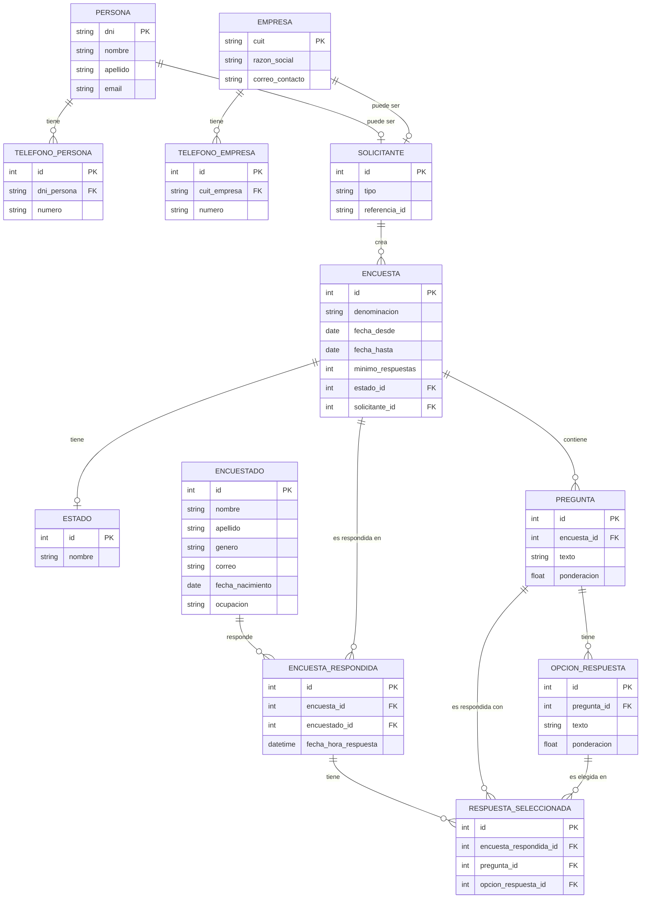

# Sistema de Gestión de Encuestas

Este proyecto tiene como objetivo desarrollar un sistema para gestionar el ciclo de vida completo de las encuestas, desde su creación hasta el procesamiento de sus resultados. La empresa necesita una solución que sistematice el proceso de diseño, generación, distribución, y análisis de encuestas.

### Descripción General

El sistema permitirá a los clientes (personas o empresas) crear encuestas con preguntas y respuestas ponderadas. Los usuarios podrán responder las encuestas, y el sistema procesará las respuestas y generará resultados ponderados. Además, el sistema permitirá visualizar los resultados completos de cada encuesta respondida.

### Requisitos Funcionales

1. **Solicitante**: Cada encuesta puede ser solicitada por una persona o empresa. Se gestionan datos personales o de contacto de la empresa.
2. **Encuestas**: Cada encuesta tiene un título, fechas de publicación, una cantidad mínima de respuestas y un estado (en carga, abierta, cerrada, procesada).
3. **Preguntas y Respuestas**: Las encuestas contienen preguntas con respuestas posibles, cada una con una ponderación entre 0 y 1.
4. **Encuestados**: Los usuarios pueden responder las encuestas, registrando sus datos y las respuestas seleccionadas.
5. **Procesamiento**: Solo se procesan encuestas cerradas. El sistema calcula ponderaciones generales y por pregunta.
6. **Visualización**: Se permite visualizar los resultados de encuestas respondidas, incluyendo los detalles del encuestado y sus respuestas.

### Diagrama Entidad-Relación (DER)

