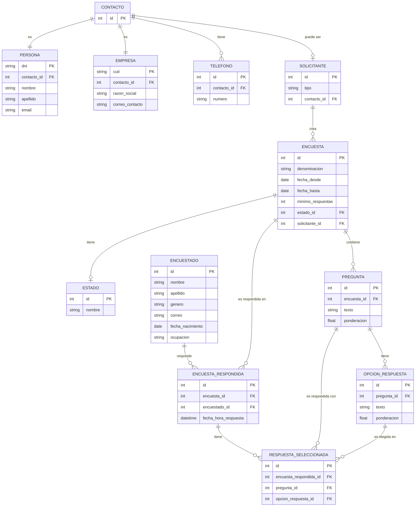

# 📊 Sistema de Gestión de Encuestas

Este proyecto tiene como objetivo desarrollar un sistema que gestione de forma integral el ciclo de vida de las encuestas, desde su creación hasta el procesamiento y visualización de resultados.
Está diseñado para una empresa especializada en diseño, generación, distribución y análisis de encuestas, con el fin de sistematizar y optimizar estos procesos.

---

## 🌐 Descripción General

El sistema permitirá a los **clientes** (personas o empresas) solicitar la creación de encuestas con **preguntas y respuestas ponderadas**.
Los **usuarios** podrán responder dichas encuestas, y el sistema procesará los resultados generando **informes detallados**.
Además, ofrecerá funcionalidades para visualizar y auditar cada encuesta respondida, ya sea de forma individual o masiva.

---

## ✅ Requisitos Funcionales

### 1️⃣ Solicitante de la Encuesta

#### Persona

* DNI (entre 5.000.000 y 50.000.000)
* Nombre y apellido
* Correo electrónico (debe contener "@")
* Mínimo 2 teléfonos (móviles o fijos)

#### Empresa

* CUIT
* Razón social (en mayúsculas)
* Correo de contacto (debe contener "@")
* Mínimo 2 teléfonos (móviles o fijos)

---

### 2️⃣ Encuestas

Cada encuesta cuenta con:

* 📝 **Denominación**: Título o descripción del objetivo.
* 📅 **Fechas de publicación**:

  * **Desde**: Mínimo 14 días después de la fecha actual y máximo 45 días.
  * **Hasta**: No más de 10 días posteriores a la fecha *Desde*.
* 📊 **Cantidad mínima de respuestas**: Ejemplo: 100, 1500.
* 🔄 **Estado**:

  * `En carga`: En elaboración.
  * `Abierta`: Disponible para ser contestada.
  * `Cerrada`: Lista para ser procesada.
  * `Procesada`: Resultado calculado.

---

### 3️⃣ Preguntas

* Cada encuesta puede tener entre **1 y 7 preguntas**.
* Cada pregunta incluye:

  * Texto de la pregunta.
  * Ponderación (entre 0 y 1).
* 🔢 La suma total de ponderaciones debe ser **exactamente 1**.

---

### 4️⃣ Respuestas Posibles

* Cada pregunta debe tener entre **1 y 5 respuestas**.
* Cada respuesta incluye:

  * Texto de la respuesta.
  * Ponderación (entre 0 y 1)

    > Debe haber al menos una respuesta con ponderación 1.

---

### 5️⃣ Encuestados (Encuestas Respondidas)

Los usuarios podrán responder las encuestas registrando:

* Nombre y apellido
* Género
* Correo electrónico
* Fecha de nacimiento (edad entre 16 y 99 años)
* Ocupación
* Fecha y hora de registro
* ✅ Se guarda la respuesta seleccionada para cada pregunta.

---

### 6️⃣ Procesamiento de Encuestas

Solo se procesan encuestas que:

* Alcancen la cantidad mínima de respuestas.
* Estén en estado **cerrada**.

#### 🔎 Cálculos realizados:

* Ponderación total de la encuesta (promedio de todas las respuestas).
* Ponderación total por usuario (suma ponderada de sus respuestas).
* Ponderación por pregunta (ponderación pregunta × ponderación respuesta).

⚡ Soporta **carga masiva** vía archivo CSV (ver sección *Carga Masiva*).

---

### 7️⃣ Visualización de Encuestas Respondidas

Permite ver en detalle:

* Datos del usuario que respondió.
* Fecha y hora de la respuesta.
* Todas las preguntas y sus posibles respuestas (resaltando la seleccionada ✅).

---

## 🚀 Requisitos No Funcionales

* La carga de respuestas puede realizarse:

  * 🌐 **Web**: Página donde el usuario completa la encuesta.
  * 📂 **Masiva (CSV)**: Subida de archivo procesado mediante procedimiento almacenado y transacciones.

    * El archivo se procesa completo, registrando errores.
    * Se informa cuántas respuestas fueron procesadas correctamente y cuántas fallaron (con detalle de errores).

✔️ **Validaciones robustas** para asegurar integridad de datos:

* Fechas válidas de publicación.
* Límites en preguntas (1-7) y respuestas (1-5).
* Edad del usuario (16-99 años).
* Ponderaciones que suman exactamente 1 donde corresponda.

---

## 📚 Ejemplo de Procesamiento

**Encuesta**: *"Calidad del servicio urbano"*

**Preguntas**:

1. Puntualidad (0.5)
2. Higiene (0.25)
3. Estado de asientos (0.25)

**Respuesta de usuario**:

* Seleccionó opciones con ponderaciones: 1, 0.5 y 1

**Cálculo**:

```
Ponderación total = (0.5 × 1) + (0.25 × 0.5) + (0.25 × 1)
                 = 0.5 + 0.125 + 0.25
                 = 0.875
```

Este cálculo se repite para cada usuario, y el promedio general determina la ponderación total de la encuesta.

---

## 🗂️ Diagrama Entidad-Relación (DER)

